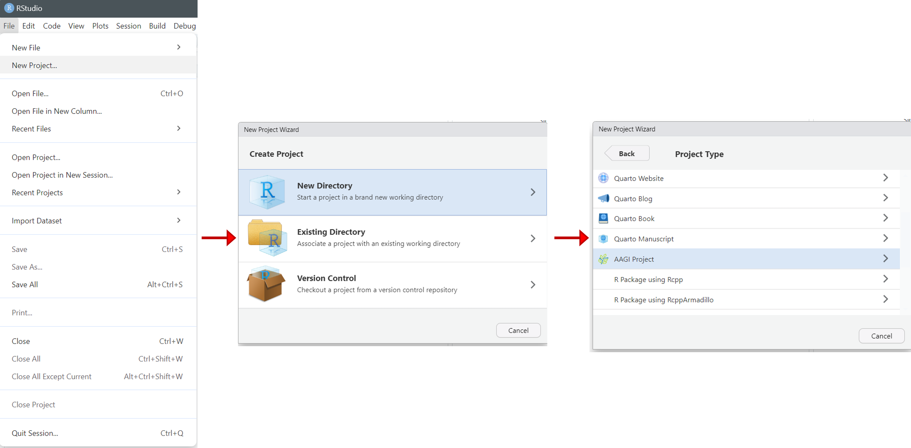
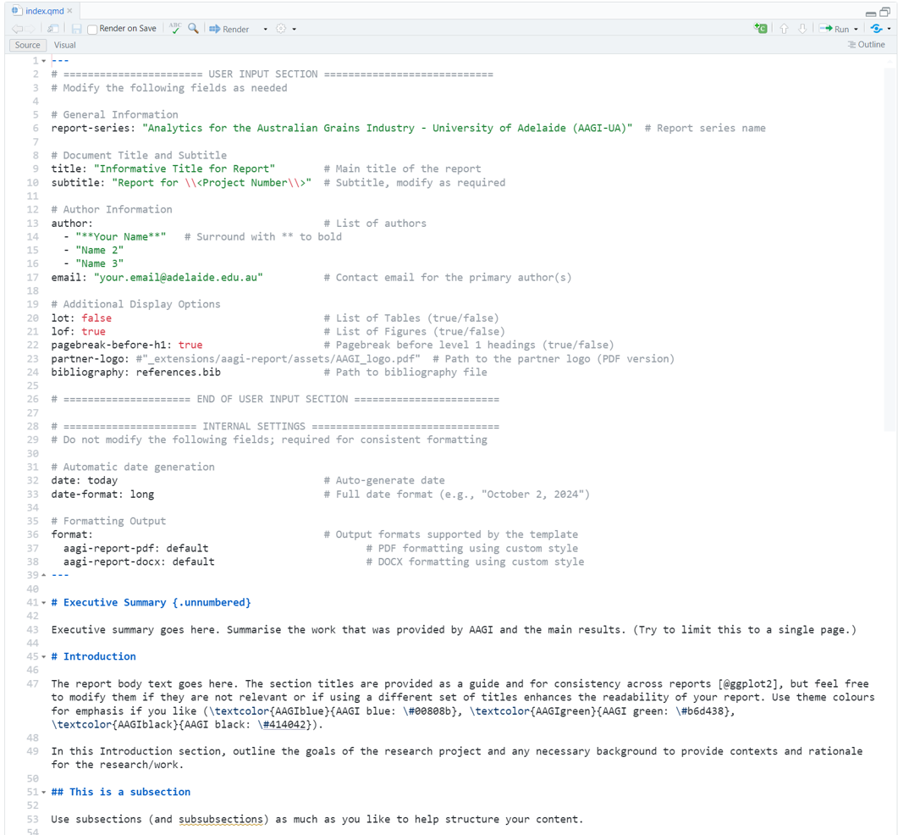
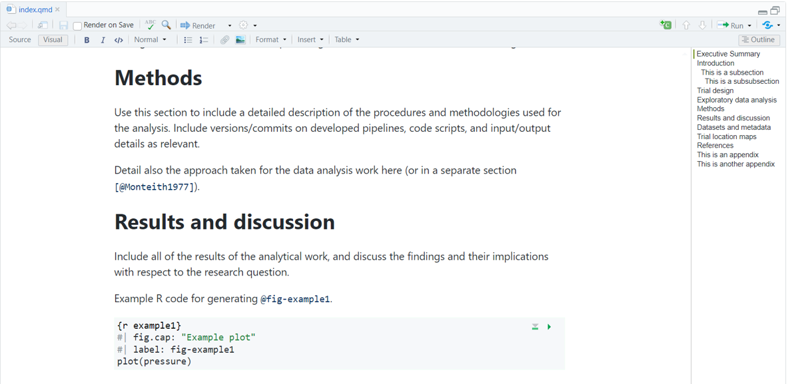
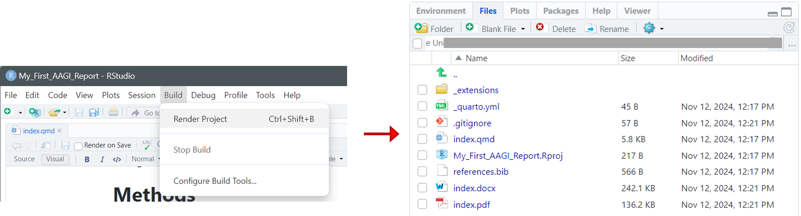
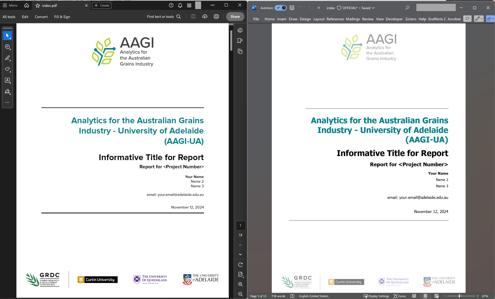
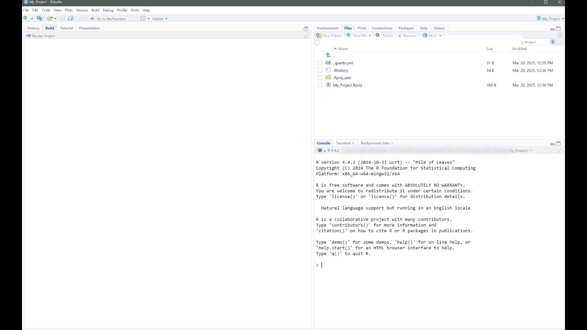

<!-- README.md is generated from README.Rmd. Please edit that file -->

# AAGIQuartoExtra

<!-- badges: start -->

[](https://lifecycle.r-lib.org/articles/stages.html#experimental)
[](https://github.com/jafernandez01/AAGIQuartoExtra/actions/workflows/R-CMD-check.yaml)

<!-- badges: end -->

The goal of AAGIQuartoExtra is to make use of AAGI Quarto templates a
bit easier. It provides convenience functions to create AAGI Quarto
projects and update current projects with the most recent templates.

## Installation

You can install the development version of AAGIQuartoExtra from
[GitHub](https://github.com/) with:

``` r
# install.packages("remotes")
remotes::install_github("jafernandez01/AAGIQuartoExtra")
```

## Create a new AAGI quarto project

In RStudio, you can create a new AAGI Quarto document by clicking on
`File -> New Project... -> New Directory -> AAGI Project`. This will
create a new AAGI project with the basic structure and template files.



You will be prompted to enter the name of the project, the university
partner, and the type of document you want to create (\**only
**aagi-report** is available as of version 0.2.0*). The project will be
created as a subdirectory in the specified working directory.

If you are familiar with projects environments, you also have the
options to set renv and python virtual environments in the project.


When your AAGI project is created, you will notice that the new
`index.qmd` file is created with the title of the project. This is the
main document where you will write your content. You will notice that it
includes some example content to get you started.



You can also open the `index.qmd` file in the Visual Editor by clicking
on the `Visual` button in the RStudio toolbar. This will open the
document in the Visual Editor where you can see a live preview of your
document as you write.



Now, to convert the `index.qmd` file to a PDF and Word document, you can
click on `Build -> Render Project` in the RStudio toolbar. This will
render the document to PDF and Word formats and save them in the project
directory as `index.pdf` and `index.docx`.



If everything is set up correctly, you should see the rendered PDF and
Word documents in the project directory. You can open these files to see
the final output of your document.



## Create a new AAGI quarto document

You can also create a new AAGI Quarto document by running the
`new_aagi_document()` function in the R console. This function will
create a new AAGI Quarto document in the current working directory.

``` r
AAGIQuartoExtra::new_aagi_document()
```

<p align="center">

</p>
